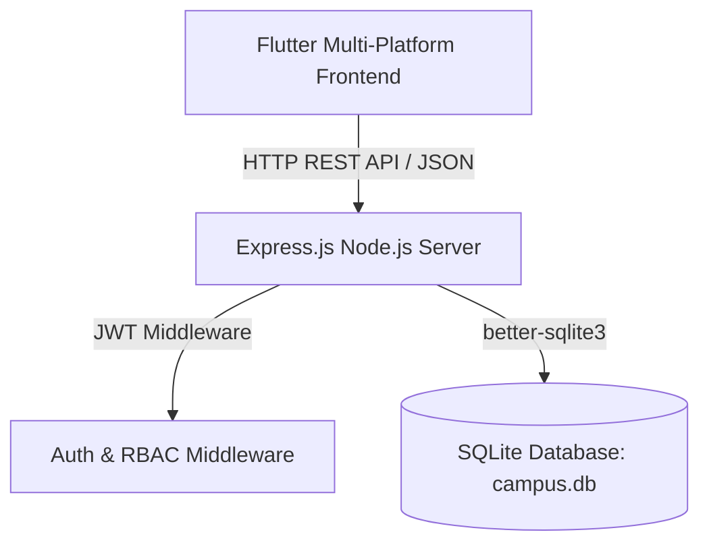

# Smart Campus Management System - Technical Documentation

## Executive Summary

The **Smart Campus Management System** (Group 6 Project) is a comprehensive academic and campus administrative solution. It integrates a **Flutter multi-platform frontend** with an **Express.js + SQLite REST API backend**, featuring Role-Based Access Control (RBAC) for Admins, Faculty members, and Students.

---

## 📹 Video Demonstration

A full demonstration recording showcasing user registration, role-based dashboards, attendance management, grade uploads, and campus notices is available:

- 🎬 **Video File**: [`Group 6 Project .mp4`](file:///Users/adarsh/Desktop/Flutter/Assignment%20/itm-flutter-miniproject-smart-campus-management-system-10-09-2026/Group%206%20Project%20/Group%206%20Project%20.mp4)

---

## 🏗️ System Architecture



### Stack Components

1. **Frontend (Flutter)**:
   - Framework: Flutter 3.13+ (Dart)
   - State Management: `provider`
   - Networking: `http` package
   - Persistence: `shared_preferences`
   - Design: Material 3, Google Fonts

2. **Backend (Node.js & Express)**:
   - Runtime: Node.js
   - API Framework: Express.js
   - Security: `jsonwebtoken` (JWT), `bcryptjs` password hashing
   - CORS enabled for cross-origin web/mobile integration

3. **Database (SQLite)**:
   - File: `campus.db`
   - Library: `better-sqlite3`

---

## 🗄️ Database Schema

### 1. `users` Table
| Column | Type | Constraints | Description |
| --- | --- | --- | --- |
| `id` | INTEGER | PRIMARY KEY AUTOINCREMENT | Unique User ID |
| `name` | TEXT | NOT NULL | User full name |
| `email` | TEXT | UNIQUE NOT NULL | User email address |
| `password` | TEXT | NOT NULL | Bcrypt hashed password |
| `role` | TEXT | CHECK(admin, faculty, student) | User role |
| `department` | TEXT | Optional | Department name |
| `created_at` | DATETIME | DEFAULT CURRENT_TIMESTAMP | Registration timestamp |

### 2. `courses` Table
| Column | Type | Constraints | Description |
| --- | --- | --- | --- |
| `id` | INTEGER | PRIMARY KEY AUTOINCREMENT | Course ID |
| `name` | TEXT | NOT NULL | Course title |
| `code` | TEXT | UNIQUE NOT NULL | Course code (e.g. CS101) |
| `faculty_id` | INTEGER | REFERENCES users(id) | Assigned faculty ID |
| `department` | TEXT | Optional | Offering department |
| `created_at` | DATETIME | DEFAULT CURRENT_TIMESTAMP | Creation timestamp |

### 3. `attendance` Table
| Column | Type | Constraints | Description |
| --- | --- | --- | --- |
| `id` | INTEGER | PRIMARY KEY AUTOINCREMENT | Record ID |
| `student_id` | INTEGER | REFERENCES users(id) | Enrolled student ID |
| `course_id` | INTEGER | REFERENCES courses(id) | Associated course ID |
| `date` | TEXT | NOT NULL | Date of attendance (YYYY-MM-DD) |
| `status` | TEXT | CHECK(present, absent, late) | Attendance status |
| `marked_by` | INTEGER | REFERENCES users(id) | Faculty/Admin who marked record |

### 4. `grades` Table
| Column | Type | Constraints | Description |
| --- | --- | --- | --- |
| `id` | INTEGER | PRIMARY KEY AUTOINCREMENT | Grade entry ID |
| `student_id` | INTEGER | REFERENCES users(id) | Student ID |
| `course_id` | INTEGER | REFERENCES courses(id) | Course ID |
| `exam_type` | TEXT | NOT NULL | Assessment type (e.g. Midterm, Final) |
| `marks` | REAL | NOT NULL | Scored marks |
| `total_marks` | REAL | NOT NULL | Maximum possible marks |
| `uploaded_by` | INTEGER | REFERENCES users(id) | Faculty/Admin ID |

### 5. `notices` Table
| Column | Type | Constraints | Description |
| --- | --- | --- | --- |
| `id` | INTEGER | PRIMARY KEY AUTOINCREMENT | Notice ID |
| `title` | TEXT | NOT NULL | Notice headline |
| `content` | TEXT | NOT NULL | Notice body text |
| `target_role` | TEXT | DEFAULT 'all' | Target audience (all, faculty, student) |
| `posted_by` | INTEGER | REFERENCES users(id) | Author ID |
| `created_at` | DATETIME | DEFAULT CURRENT_TIMESTAMP | Posting timestamp |

---

## 🔐 Role-Based Access Control (RBAC) Matrix

| Module / Feature | Admin | Faculty | Student |
| --- | :---: | :---: | :---: |
| System Statistics Dashboard | ✅ | ❌ | ❌ |
| User Registration & Management | ✅ | ❌ | ❌ |
| Course Creation & Assignment | ✅ | ❌ | ❌ |
| Mark Student Attendance | ✅ | ✅ | ❌ |
| View Personal Attendance | ✅ | ✅ | ✅ |
| Upload & Edit Grades | ✅ | ✅ | ❌ |
| View Subject Grades | ✅ | ✅ | ✅ |
| Post Campus Notices | ✅ | ✅ | ❌ |
| View Notice Board | ✅ | ✅ | ✅ |

---

## 📡 API Endpoint Reference

### Authentication Routes (`/api/auth`)
- `POST /api/auth/login`: Accepts `{ email, password }`, returns JWT token & user profile.
- `POST /api/auth/register`: Accepts `{ name, email, password, role, department }`. Requires Admin JWT.

### User Management (`/api/users`)
- `GET /api/users`: Returns array of registered users (Admin only).
- `PUT /api/users/:id`: Updates user profile information.
- `DELETE /api/users/:id`: Removes a user from the system.

### Course Routes (`/api/courses`)
- `GET /api/courses`: List all available courses.
- `POST /api/courses`: Create a new course (Admin only).
- `DELETE /api/courses/:id`: Delete a course.

### Attendance Routes (`/api/attendance`)
- `GET /api/attendance`: Retrieve attendance logs filtered by student/course.
- `POST /api/attendance`: Record daily attendance for students.

### Grade Routes (`/api/grades`)
- `GET /api/grades`: Fetch student exam scores and assessment grades.
- `POST /api/grades`: Post student marks and grade evaluations.

### Notice Routes (`/api/notices`)
- `GET /api/notices`: Fetch active campus notices and announcements.
- `POST /api/notices`: Publish a new announcement.
- `DELETE /api/notices/:id`: Remove an announcement.

### Dashboard Routes (`/api/dashboard`)
- `GET /api/dashboard`: Fetch role-specific statistics and metric counters.

---

## 🚀 Step-by-Step Setup Guide

### 1. Server Environment Setup

```bash
cd "Group 6 Project /backend"
npm install
npm run seed
npm start
```
- Server starts on `0.0.0.0:3000`.
- Initial Admin Account: `admin@campus.com` / `admin123`.

### 2. Client Application Setup

```bash
cd "Group 6 Project /smart_campus"
flutter pub get
flutter run -d chrome
```

---

## 🧪 Quality Assurance & Build Commands

To verify client code quality and generate web distribution artifacts:

```bash
cd "Group 6 Project /smart_campus"
flutter analyze
flutter build web
```
